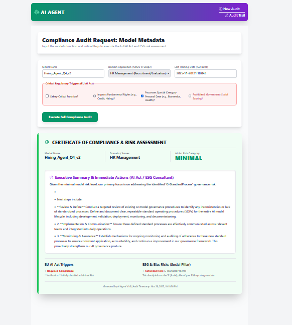
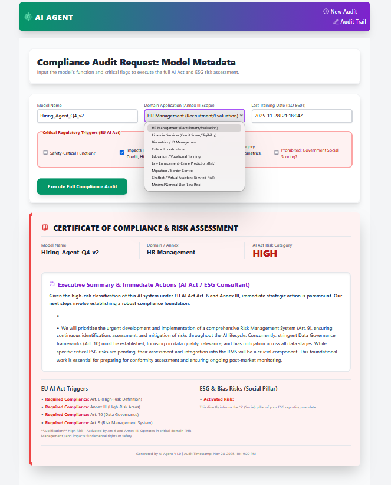
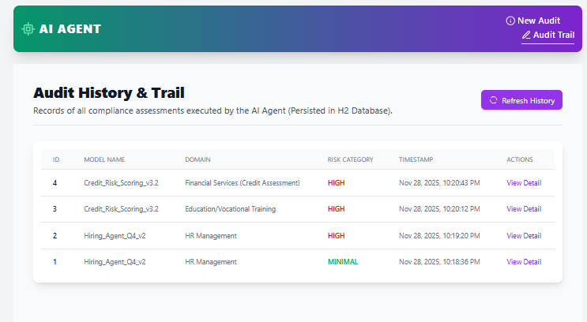
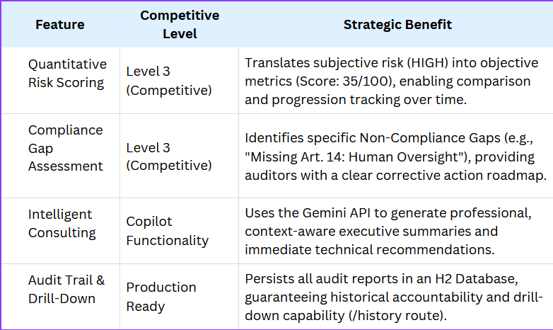
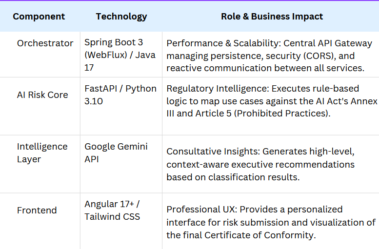
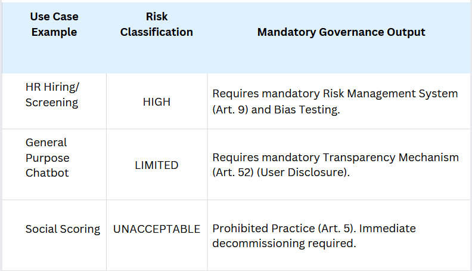

# 🛡️ AI Act & ESG Compliance Agent (v1.0)

 Enterprise-Grade AI Governance for the European Market

🎯 Executive Summary & Value Proposition

The AI Compliance Agent is a full-stack governance solution that automates AI risk assessment and compliance gap closure against the stringent EU AI Act. It transforms complex regulatory mandates into actionable MLOps/IT tasks, offering immediate, quantifiable defense against severe non-compliance penalties and establishing a clear path to ethical AI operation.

✨ Core Value Proposition

This Agent serves as a critical bridge between Regulatory Compliance, Ethical Governance (ESG), and Technical Execution.

🏗️ Enterprise Architecture & Technology Stack

The solution is built on a resilient, decoupled Microservices Architecture, showcasing expertise in integrating best-of-breed enterprise and data science tools.

Agent Logic: The GRC Matrix in Action

The core logic immediately translates model purpose into governance requirements:

🚀 Developer Setup & Execution

Prerequisites

Java 17+, Python 3.10+, Node.js/npm.

A Gemini API Key must be set as an environment variable (GEMINI_API_KEY).

Execution Guide

To initiate the complete ecosystem, follow the detailed guide in {SETUP_GUIDE.md}. The process requires three active terminals:

git clone https://[github.com/silvatechf/codeguard-ai.git cd codeguard-ai](https://github.com/silvatechf/ai-act-esg-compliance-agent.git)

Example START commands:

Terminal 1: python -m uvicorn ai_agent.api.main:app --port 5000

Terminal 2: ./mvnw spring-boot:run

Terminal 3: ng serve --open

# ⭐ Conclusion

This project represents a practical, end-to-end implementation of an AI governance framework, proving highly sought-after expertise in both critical regulatory compliance and modern, high-performance microservices architecture.

👤 Author

Fernando Silva Software Engineer | Java & Angular Specialist | AI Enthusiast

LinkedIn https://www.linkedin.com/in/fernando-silva-83b155a4/

© 2025 CodeGuard AI. All rights reserved.

